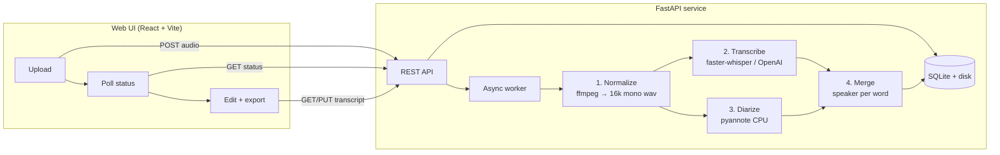

# idle-scribe

Self-hosted, **Afrikaans-first** speech-to-text with speaker diarization. Upload an
audio file in the browser and get back an accurate, timestamped transcript that
knows *who said what when* — then edit it inline and export it.

Transcription and diarization are deliberately independent stages that merge at
the end, which keeps the transcription engine pluggable (a local Whisper model
and the OpenAI API both just produce text + word timestamps; speaker labels are
layered on separately).

## Features

- Upload → normalize → transcribe → diarize → merge, as an async job with status polling
- **Pluggable engines**, selectable per job: `faster-whisper` `large-v3` on GPU (default) or OpenAI as a fallback
- **Speaker diarization** via `pyannote.audio` with word-level speaker assignment
- **Editable transcript editor** (text + speaker), with audio playback
- Every text correction is stored as a **training pair** (audio time range ↔ corrected text) for future fine-tuning
- Per-job **language hint** (auto / Afrikaans / English)
- Export to **txt / srt / vtt / json**

## Architecture



## Project layout

```
backend/
  app/
    main.py              FastAPI app + routes
    config.py            settings (env-overridable, IDLE_SCRIBE_ prefix)
    db.py                SQLite job + corrections store
    worker.py            single-consumer async job pipeline
    audio.py             ffmpeg normalize
    cuda_setup.py        Windows CUDA DLL discovery (cuBLAS/cuDNN)
    merge.py             pure word→speaker merge
    export.py            txt/srt/vtt/json renderers
    engines/             TranscriptionEngine protocol + faster-whisper, OpenAI
    diarize/             Diarizer protocol + pyannote (CPU)
  scripts/               Afrikaans sample fetch, WER benchmark, LoRA→CT2 convert
  tests/                 merge unit tests
  requirements*.txt      layered dependency sets (see below)
frontend/                Vite + React + TypeScript app
PLAN.md                  design doc + milestone log
```

## Prerequisites

- **Python 3.11+** (developed and tested on 3.13)
- **Node 22+** / npm (for the frontend)
- **ffmpeg** and **ffprobe** on `PATH`
- For GPU transcription: an **NVIDIA CUDA GPU** (tested on an RTX 2070, 8 GB).
  Set `IDLE_SCRIBE_WHISPER_DEVICE=cpu` to run on CPU instead (much slower).
- For diarization: a **HuggingFace account + token** with the gated model terms
  accepted (see [Diarization](#diarization--huggingface)).

## Setup

### Backend

```bash
cd backend
python -m venv .venv
# Windows: .venv\Scripts\activate   |   macOS/Linux: source .venv/bin/activate
pip install -r requirements.txt          # base API
pip install -r requirements-ml.txt       # GPU transcription (faster-whisper + CUDA libs)
pip install -r requirements-diarize.txt  # speaker diarization (pyannote, CPU)
```

Dependency sets are layered so you only install what you need:

| File | Purpose |
|---|---|
| `requirements.txt` | Base API (FastAPI, uvicorn, pydantic-settings, OpenAI SDK) |
| `requirements-ml.txt` | Local GPU transcription: `faster-whisper` + NVIDIA cuBLAS/cuDNN |
| `requirements-diarize.txt` | `pyannote.audio` + `soundfile` (diarization on CPU) |
| `requirements-eval.txt` | `datasets`, `jiwer` — Afrikaans WER benchmark tooling |
| `requirements-convert.txt` | `transformers`, `peft` — merge a LoRA fine-tune → CTranslate2 |
| `requirements-dev.txt` | `pytest` |

> On Windows, `pyannote.audio` (PyTorch) and `faster-whisper` (CTranslate2) ship
> different CUDA stacks. Diarization is configured to run on **CPU** to avoid a
> cuDNN conflict and VRAM contention on smaller GPUs. The app loads audio for
> pyannote in-memory (via `soundfile`) and applies a small startup patch for a
> Windows-only speechbrain lazy-import bug.

### Frontend

```bash
cd frontend
npm install
npm run dev          # http://127.0.0.1:5173
```

The frontend talks to the backend at `http://127.0.0.1:8000` by default; override
with a `VITE_API_BASE` env var.

## Running

```bash
# terminal 1 — backend
cd backend && python -m uvicorn app.main:app --port 8000

# terminal 2 — frontend
cd frontend && npm run dev
```

Open http://127.0.0.1:5173, upload an audio file, and watch it run.

## Configuration

All settings are overridable via environment variables with the `IDLE_SCRIBE_`
prefix (e.g. `IDLE_SCRIBE_WHISPER_COMPUTE_TYPE=int8_float16`).

| Setting | Default | Notes |
|---|---|---|
| `transcription_engine` | `faster_whisper` | or `openai` |
| `whisper_model` | `large-v3` | named size, or a path to a converted CTranslate2 model |
| `whisper_device` | `cuda` | `cpu` to run without a GPU |
| `whisper_compute_type` | `float16` | `int8_float16` uses less VRAM |
| `whisper_language` | _(autodetect)_ | global default; overridable per job |
| `openai_model` | `whisper-1` | only `whisper-*` returns word timestamps |
| `openai_api_key` | — | else read from `OPENAI_API_KEY` |
| `enable_diarization` | `true` | degrades gracefully to transcribe-only on failure |
| `diarization_model` | `pyannote/speaker-diarization-community-1` | gated |
| `diarization_device` | `cpu` | |
| `hf_token` | — | else uses the `huggingface-cli login` cache / `HF_TOKEN` |
| `cors_origins` | `localhost:5173, 127.0.0.1:5173` | comma-separated |

## API

| Method | Path | Description |
|---|---|---|
| `GET` | `/health` | status, ffmpeg, available engines, diarization |
| `POST` | `/jobs` | upload audio (`file`, optional `engine`, `language`) → job |
| `GET` | `/jobs` | list jobs |
| `GET` | `/jobs/{id}` | job status |
| `GET` | `/jobs/{id}/transcript` | latest transcript (edited if present) |
| `PUT` | `/jobs/{id}/transcript` | save edits; records corrections as training pairs |
| `GET` | `/jobs/{id}/audio` | normalized WAV (for playback) |
| `GET` | `/jobs/{id}/export?format=txt\|srt\|vtt\|json` | download |

## Diarization & HuggingFace

`pyannote` models are gated. Once, while logged in:

1. Create a token at https://huggingface.co/settings/tokens (a `read` token is enough).
2. Accept the conditions on the gated model page(s) — at minimum
   `pyannote/speaker-diarization-community-1`.
3. `huggingface-cli login` (caches the token locally), or set `HF_TOKEN`.

The models run locally; the token is only used to download them. If no token is
present, diarization is skipped and jobs still complete (transcribe-only).

## Afrikaans & fine-tuning

The default `large-v3` handles Afrikaans (≈28% WER on FLEURS `af_za` in our
tests). A generic public Afrikaans LoRA fine-tune did **not** beat stock on
out-of-domain audio — meaningful gains need fine-tuning on in-domain (your own)
speech. To that end, every correction made in the editor is stored as a training
pair. Tooling in `scripts/`:

- `fetch_afrikaans_samples.py` — pull FLEURS `af_za` clips + references
- `benchmark_afrikaans.py` — measure WER for any model (size or CTranslate2 path)
- `convert_finetune.py` — merge a LoRA/PEFT Whisper fine-tune and convert it to
  CTranslate2 so it can be loaded via `whisper_model=<path>`

## Status & limitations

v1 is feature-complete (upload → speaker-attributed, editable, exportable
transcripts). Known limitations:

- OpenAI transcription rejects files larger than 25 MB (no chunking yet)
- CPU diarization is roughly real-time, so long files take a while
- `large-v3` in float16 needs ~5 GB VRAM; drop to `int8_float16` on smaller cards

See `PLAN.md` for the full design rationale and milestone history.
